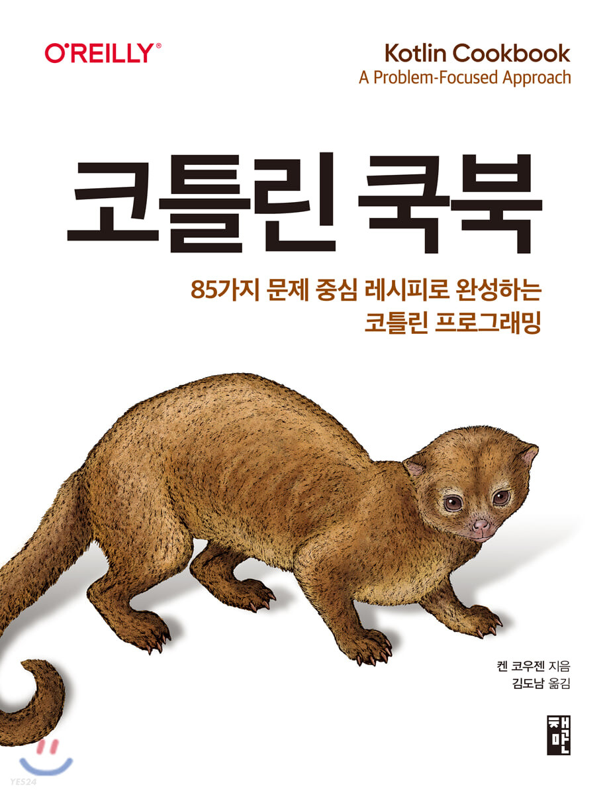

## 목차

* 1장. 코틀린 설치와 실행
* [2장. 코틀린 기초](./chapter2/index.md)
* [3장. 코틀린 객체 지향 프로그래밍](./chapter3/index.md)
* [4장. 함수형 프로그래밍](./chapter4/index.md)
* [5장. 컬렉션](./chapter5/index.md)
* [6장. 시퀀스](./chapter6/index.md)
* [7장. 영역 함수](./chapter7/index.md)
* [8장. 코틀린 대리자](./chapter8/index.md)
* [9장. 테스트](./chapter9/index.md)
* [10장. 입력/출력](./chapter10/index.md)
* [11장. 그 밖의 코틀린 기능](./chapter11/index.md)
* [12장. 스프링 프레임워크](./chapter12/index.md)
* [13장. 코루틴과 구조적 동시성](./chapter13/index.md)